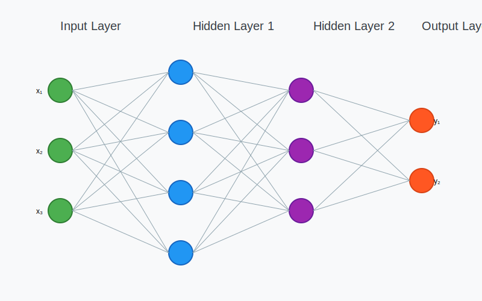

# Multi-Layer Perceptron (MLP)

## Overview

A Multi-Layer Perceptron (MLP) is a class of feedforward artificial neural network that consists of multiple layers of neurons. It represents a significant advancement over single-layer perceptrons by being able to learn non-linear relationships in data through multiple processing layers.

---

## Architecture Components

### 1. Input Layer
- Receives raw input features
- No computation performed
- One neuron per input feature
- Passes data to the first hidden layer

### 2. Hidden Layers
- One or more intermediate layers
- Each neuron connected to all neurons in adjacent layers
- Performs non-linear transformations
- Extracts hierarchical features

### 3. Output Layer
- Produces the network's final output
- Architecture depends on the task:
  - Single neuron for binary classification
  - Multiple neurons for multi-class classification
  - Continuous values for regression

## Mathematical Framework

### 1. Forward Propagation

For each layer $$l$$, the output $$a^{(l)}$$ is computed as:

$$z^{(l)} = W^{(l)}a^{(l-1)} + b^{(l)}$$
$$a^{(l)} = f(z^{(l)})$$

Where:
- W(l) is the weight matrix
- b(l) is the bias vector
- f is the activation function

### 2. Common Activation Functions

1. **ReLU (Rectified Linear Unit)**:
   $$f(x) = \max(0, x)$$

2. **Sigmoid**:
   $$f(x) = \frac{1}{1 + e^{-x}}$$

3. **Tanh**:
   $$f(x) = \frac{e^x - e^{-x}}{e^x + e^{-x}}$$

## Training Process

### 1. Backpropagation Algorithm
- Computes gradients of the error with respect to weights
- Propagates error backwards through the network
- Uses chain rule of calculus

### 2. Weight Update
For each weight 
$$w_{ij} $$
We get
$$w_{ij}^{new} = w_{ij}^{old} - \alpha \frac{\partial E}{\partial w_{ij}}$$

Where:
- α is the learning rate
- E is the error function
- ∂E/∂w is the gradient

## Key Features

### 1. Non-linear Capabilities
- Can approximate any continuous function
- Solves XOR and other non-linearly separable problems
- Universal function approximator

### 2. Hierarchical Feature Learning
- Each layer learns increasingly abstract features
- Automatically discovers relevant patterns
- Reduces need for manual feature engineering

### 3. Flexibility
- Adaptable to various types of problems
- Scalable architecture
- Compatible with different optimization algorithms

## Hyperparameters

1. **Network Architecture**
   - Number of hidden layers
   - Neurons per layer
   - Connectivity patterns

2. **Training Parameters**
   - Learning rate
   - Batch size
   - Number of epochs
   - Momentum
   - Weight initialization method

3. **Regularization**
   - Dropout
   - L1/L2 regularization
   - Early stopping

## Common Applications

1. **Pattern Recognition**
   - Image classification
   - Speech recognition
   - Text analysis

2. **Regression Tasks**
   - Time series prediction
   - Function approximation
   - Value estimation

3. **Feature Learning**
   - Dimensionality reduction
   - Feature extraction
   - Data encoding

## Advantages and Limitations

### Advantages
1. Powerful non-linear modeling capability
2. Automatic feature learning
3. Parallelizable architecture
4. Adaptability to various problems

### Limitations
1. Requires significant training data
2. Computationally intensive
3. Risk of overfitting
4. Black-box nature
5. Sensitive to hyperparameter choices

## Best Practices

1. **Data Preprocessing**
   - Normalization/Standardization
   - Feature scaling
   - Missing value handling

2. **Architecture Design**
   - Start with simple architectures
   - Gradually increase complexity
   - Use cross-validation

3. **Training Strategy**
   - Monitor validation performance
   - Implement early stopping
   - Use learning rate scheduling

---
