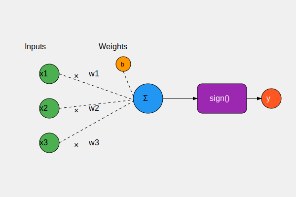

# Perceptron Neural Network

## Overview

The Perceptron is a fundamental machine learning algorithm introduced by Frank Rosenblatt in 1957, building upon the McCulloch-Pitts neuron model. It represents a significant advancement in neural computing, providing a learning mechanism for binary classification problems.

## Key Characteristics

### Structure
- **Single-Layer Neural Network**: Consists of a single neuron with adjustable weights
- **Binary Classifier**: Designed to separate two linearly separable classes
- **Learning Capability**: Can modify its weights through an iterative learning algorithm

### Mathematical Model

1. **Input Processing**:
   - Receives multiple numerical inputs
   - Each input is multiplied by a corresponding weight
   - Adds a bias term to introduce flexibility in decision boundary

2. **Activation Function**:
   - Uses a step function or sign function
   - Classifies input into two categories (typically +1 or -1)

## Learning Algorithm

### Perceptron Learning Rule
The core of the Perceptron is its learning mechanism:
- Initialize weights randomly
- For each training example:
  1. Compute the predicted output
  2. Compare with the actual output
  3. Update weights based on the error

### Weight Update Formula
$$w_{i(t+1)} = w_{i(t)} + \alpha(y - \hat{y})x_i$$

Where:
- wi is the weight for input xi
- α is the learning rate
- y is the true label
- y^ is the predicted label

## Mathematical Representation

Let:
- x = Input vector
- w = Weight vector
- b = Bias term

The Perceptron output $$\hat{y}$$ is defined as:

$$\hat{y} = \text{sign}(w \cdot x + b)$$

Where the sign function is:

$$\text{sign}(z) = \begin{cases} 
1 & \text{if } z \geq 0 \\
-1 & \text{if } z < 0
\end{cases}$$

## Limitations

1. **Linear Separation Only**: Can only classify linearly separable problems
2. **Limited Complexity**: Cannot solve XOR or other non-linear problems
3. **Convergence Challenges**: Not guaranteed to converge for all datasets
4. **Binary Classification**: Restricted to two-class problems

## Historical Significance

- **First Learning Algorithm for Neural Networks**
- **Theoretical Breakthrough**: Demonstrated how machines could learn from data
- **Inspired Further Neural Network Research**
- **Foundation for More Complex Neural Network Architectures**

## Modern Context

While the Perceptron is now considered simplistic, its core principles remain influential:
- Fundamental to understanding neural network learning
- Basis for more advanced classification algorithms
- Conceptual predecessor to modern multi-layer neural networks
 
 