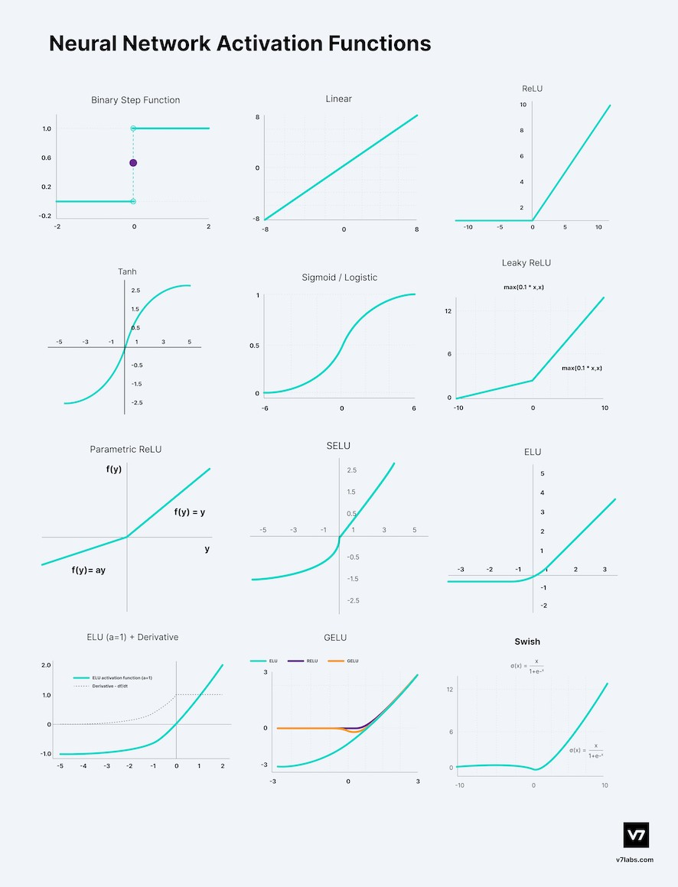

# Activation Functions in Neural Networks

## Overview

Activation functions are crucial components of neural networks that introduce non-linearity, enabling deep learning models to learn complex patterns and representations. They determine the output of a neural network node given an input or set of inputs.

## Key Types of Activation Functions

### 1. Sigmoid Activation Function

#### Mathematical Representation
$$f(x) = \frac{1}{1 + e^{-x}}$$

#### Characteristics
- Output range: (0, 1)
- Smooth gradient
- Commonly used in binary classification problems
- Suffers from vanishing gradient problem

#### Pros
- Converts output to probability-like format
- Smooth and differentiable

#### Cons
- Saturates and kills gradients
- Not zero-centered
- Computationally expensive

### 2. Hyperbolic Tangent (Tanh)

#### Mathematical Representation
$$f(x) = \frac{e^x - e^{-x}}{e^x + e^{-x}}$$

#### Characteristics
- Output range: (-1, 1)
- Zero-centered
- Similar to sigmoid but with improved properties

#### Pros
- Zero-centered output
- Stronger gradient compared to sigmoid
- Helps mitigate some vanishing gradient issues

#### Cons
- Still suffers from vanishing gradient problem
- Computationally expensive

### 3. Rectified Linear Unit (ReLU)

#### Mathematical Representation
$$f(x) = \max(0, x)$$

#### Characteristics
- Output range: [0, ∞)
- Computationally efficient
- Helps mitigate vanishing gradient problem

#### Pros
- Sparse activation
- Computationally efficient
- Accelerates convergence
- Provides good performance in deep networks

#### Cons
- Potential "dying ReLU" problem
- Not zero-centered
- Unbounded output

### 4. Leaky ReLU

#### Mathematical Representation
$$f(x) = \begin{cases} 
x & \text{if } x \geq 0 \\
\alpha x & \text{if } x < 0
\end{cases}$$

#### Characteristics
- Addresses dying ReLU problem
- Small slope for negative values (typically α = 0.01)

#### Pros
- Prevents dead neurons
- Allows small negative gradients
- Improves ReLU's limitations

#### Cons
- Performance varies depending on α value

### 5. Softmax Activation Function

#### Mathematical Representation
$$f(x_i) = \frac{e^{x_i}}{\sum_{j=1}^{n} e^{x_j}}$$

#### Characteristics
- Used in multi-class classification
- Converts raw scores to probability distribution
- Ensures sum of probabilities equals 1

#### Pros
- Ideal for multi-class classification
- Provides probabilistic interpretation
- Differentiable

#### Cons
- Computationally expensive
- Sensitive to input scale

### 6. Swish Activation Function

#### Mathematical Representation
$$f(x) = x \cdot \sigma(x)$$

Where σ(x) is the sigmoid function

#### Characteristics
- Smooth, non-monotonic
- Performs better than ReLU in deep networks

#### Pros
- Self-gated activation
- Improved performance in deep networks
- Potentially better gradient flow

#### Cons
- More computationally complex
- Less widely adopted

### 7. Parametric ReLU (PReLU)

#### Mathematical Representation
$$f(x) = \begin{cases} 
x & \text{if } x \geq 0 \\
\alpha x & \text{if } x < 0
\end{cases}$$

Where `α` is a learnable parameter.

#### Characteristics
- Adaptive version of Leaky ReLU
- Slope for negative values is learned during training
- Allows network to determine optimal negative slope

#### Pros
- Dynamically adjusts negative slope
- Reduces information loss for negative values
- More flexible than fixed Leaky ReLU
- Can improve model performance

#### Cons
- Increases model complexity
- Additional parameters to train
- May lead to overfitting if not carefully implemented

### 8. Scaled Exponential Linear Unit (SELU)

#### Mathematical Representation
$$f(x) = \lambda \begin{cases} 
x & \text{if } x > 0 \\
\alpha(e^x - 1) & \text{if } x \leq 0
\end{cases}$$

Where λ ≈ 1.0507 and α ≈ 1.6733$$

#### Characteristics
- Self-normalizing neural networks
- Designed to maintain zero mean and unit variance
- Helps mitigate internal covariate shift

#### Pros
- Enables deep networks to self-normalize
- Reduces need for batch normalization
- Potentially faster convergence
- Handles vanishing and exploding gradients

#### Cons
- Limited use cases
- Specific initialization requirements
- May not perform well in all network architectures

### 9. Gaussian Error Linear Unit (GELU)

#### Mathematical Representation
$$f(x) = x \cdot \Phi(x)$$

Where `Φ(x)` is the cumulative distribution function of the standard normal distribution.

Approximated as:
$$f(x) \approx 0.5x(1 + \tanh(\sqrt{2/\pi}(x + 0.044715x^3)))$$

#### Characteristics
- Probabilistic activation function
- Weights inputs by their significance
- Commonly used in transformer architectures

#### Pros
- Performs exceptionally well in NLP models
- Smooth, non-linear transformation
- Better performance in deep learning models
- Provides more nuanced activation compared to ReLU

#### Cons
- Computationally more expensive
- Less intuitive compared to simpler activation functions
- May require more computational resources

---
## Choosing the Right Activation Function
### Considerations
1. **Network Architecture**
2. **Problem Domain**
3. **Computational Resources**
4. **Gradient Behavior**
5. **Output Range Requirements**

### General Guidelines
- Hidden Layers: ReLU or Leaky ReLU
- Output Layer: Depends on problem type
  - Binary Classification: Sigmoid
  - Multi-Class Classification: Softmax
  - Regression: Linear

---
## Flow chart of working of Activation Functions

