# Gradient Descent & Learning Optimizations

Gradient Descent is an optimization algorithm used to minimize a loss function by iteratively updating model parameters (weights). It adjusts the weights by moving in the direction of the steepest descent, defined by the negative gradient of the loss function.

## Evolution of Gradient Descent Methods

## Types of Gradient Descent

### 1. Batch Gradient Descent
- Updates weights using the gradient calculated over the **entire dataset**
- **Advantages**:
  - Stable convergence
  - Works well for small datasets
- **Disadvantages**:
  - Slow for large datasets
  - High memory consumption

### 2. Stochastic Gradient Descent (SGD)
- Updates weights for each **individual data point**
- **Advantages**:
  - Faster updates; efficient for large datasets
  - Can escape local minima due to randomness
- **Disadvantages**:
  - Noisy convergence; may not find an optimal solution
  - Sensitive to learning rate

### 3. Mini-Batch Gradient Descent
- Updates weights using **small batches of data** (subset of dataset)
- **Advantages**:
  - Combines benefits of batch and stochastic methods
  - Computationally efficient and stable
- **Disadvantages**:
  - Requires tuning batch size

## Learning Optimization Techniques

### 1. Momentum
- Adds a fraction of the previous update to the current update to maintain direction
- Formula:  
  $$v_t = \gamma v_{t-1} + \eta \nabla L$$
  $$w = w - v_t$$
- **Advantages**:
  - Accelerates convergence
  - Reduces oscillations

### 2. Nesterov Accelerated Gradient (NAG)
- Looks ahead by calculating the gradient at the estimated future position
- Improves upon momentum by reducing overshooting

### 3. Adagrad
- Adapts the learning rate based on past gradients for each parameter
- Formula:  
  $$w = w - \frac{\eta}{\sqrt{G_{t} + \epsilon}} \nabla L$$
  where $G_t$ is the cumulative sum of squared gradients
- **Advantages**:
  - Automatically adjusts learning rates
  - Effective for sparse data
- **Disadvantages**:
  - Learning rate decays too much over time

### 4. RMSProp
- Similar to Adagrad but uses an exponentially decaying average of past squared gradients
- Formula:  
  $$w = w - \frac{\eta}{\sqrt{E[\nabla L^2] + \epsilon}} \nabla L$$
- **Advantages**:
  - Handles non-stationary data well
  - Suitable for deep learning

### 5. Adam (Adaptive Moment Estimation)
- Combines Momentum and RMSProp by maintaining both:
  - An exponentially weighted average of past gradients
  - An exponentially weighted average of squared gradients
- Formula:  
  $$m_t = \beta_1 m_{t-1} + (1 - \beta_1) \nabla L$$
  $$v_t = \beta_2 v_{t-1} + (1 - \beta_2) (\nabla L)^2$$
  $$w = w - \frac{\eta \cdot m_t}{\sqrt{v_t} + \epsilon}$$
- **Advantages**:
  - Efficient and robust
  - Works well for most problems
  - Handles sparse and noisy gradients

### 6. AdaDelta
- An extension of Adagrad that limits accumulated past gradients to avoid rapid decay in learning rates

### 7. AMSGrad
- A variant of Adam that ensures convergence by fixing potential overshooting issues in Adam

## Summary Table

| Optimizer | Key Feature | Use Case |
|-----------|------------|-----------|
| **Momentum** | Adds velocity to updates | Faster convergence |
| **NAG** | Gradient at future position | Better directional control |
| **Adagrad** | Adapts learning rates | Sparse data |
| **RMSProp** | Smooth learning rate adaptation | Deep learning, RNNs |
| **Adam** | Combines Momentum & RMSProp | General-purpose optimization |
| **AdaDelta** | Adapts without decaying too much | Sparse data |
| **AMSGrad** | Fixes Adam's overshooting issues | Better convergence guarantees |

## Choosing the Right Optimizer
- **Simple Models**: SGD, Momentum
- **Sparse Data**: Adagrad, Adam
- **Deep Learning**: RMSProp, Adam
- **Convergence Issues**: NAG, AMSGrad