# Regularization Techniques in Deep Learning

Regularization is a set of techniques used to prevent overfitting in deep learning models by adding constraints or penalties to the learning process. These methods help improve model generalization on unseen data.

## 1. Parameter Norm Penalties (Weight Regularization)

### L1 Regularization (Lasso)
- Adds the sum of absolute values of weights to the loss function
- Formula: $$L_{total} = L_{original} + \lambda \sum_{i=1}^{n} |w_i|$$
- **Effects**:
  - Promotes sparsity in the model
  - Forces some weights to exactly zero
  - Feature selection capability
- **Use cases**:
  - When you need a sparse model
  - Feature selection is important
  - Memory efficiency is crucial

### L2 Regularization (Ridge)
- Adds the sum of squared weights to the loss function
- Formula: $$L_{total} = L_{original} + \lambda \sum_{i=1}^{n} w_i^2$$
- **Effects**:
  - Prevents weights from becoming too large
  - Smooths the model's decisions
  - All weights are pushed closer to zero
- **Use cases**:
  - Default choice for many neural networks
  - When you want to prevent extreme weight values
  - When all features might be relevant

### Elastic Net
- Combines both L1 and L2 regularization
- Formula: $$L_{total} = L_{original} + \lambda_1 \sum_{i=1}^{n} |w_i| + \lambda_2 \sum_{i=1}^{n} w_i^2$$
- **Advantages**:
  - Combines benefits of both L1 and L2
  - Better handling of correlated features
  - More robust than individual methods

## 2. Noise Injection Techniques

### Dropout

- Randomly deactivates neurons during training
- Formula: $$y = f(Wx) \cdot \text{mask}$$ where mask ∼ Bernoulli(p)
- **Hyperparameters**:
  - Dropout rate (typically 0.2-0.5)
- **Benefits**:
  - Prevents co-adaptation of neurons
  - Approximate model ensemble
  - Reduces overfitting

### DropPath (Path Dropout)
- Similar to dropout but drops entire paths in the network
- Commonly used in:
  - Residual networks
  - Dense networks
  - Neural architecture search

### Gaussian Noise
- Adds random noise to weights or activations
- Formula: $$w_{noisy} = w + \epsilon$$ where ϵ ∼ N(0, σ²)
- **Applications**:
  - Input layer noise for robustness
  - Hidden layer noise for regularization
  - Weight noise for exploration

## 3. Data Augmentation

### Traditional Augmentation
- Image domains:
  - Rotation, flipping, scaling
  - Color jittering
  - Random cropping
- Text domains:
  - Synonym replacement
  - Back-translation
  - Random deletion/insertion

### Modern Techniques
- **Mixup**:
  - Combines pairs of examples: $$\tilde{x} = \lambda x_i + (1-\lambda)x_j$$
  - Interpolates labels: $$\tilde{y} = \lambda y_i + (1-\lambda)y_j$$

- **CutMix/CutOut**:
  - Removes or replaces portions of input
  - Adjusts labels accordingly

## 4. Early Stopping

### Implementation
1. Monitor validation performance
2. Stop when performance plateaus/degrades
3. Restore best model weights

### Model Checkpointing
- Save model at regular intervals
- Keep best performing model
- Restore optimal weights

## 5. Additional Techniques

### Weight Constraints
- Max-norm regularization
- Unit-norm constraints
- Orthogonality constraints

### Label Smoothing
- Prevents overconfident predictions
- Formula: $$y_{smooth} = (1-\alpha)y + \alpha/K$$
- Typical α values: 0.1-0.2

### Batch Normalization
- Normalizes layer inputs
- Formula: $$\hat{x} = \frac{x - \mu_B}{\sqrt{\sigma_B^2 + \epsilon}}$$
- Acts as implicit regularizer

## Choosing Regularization Techniques

### Factors to Consider
1. Dataset size
2. Model complexity
3. Task type
4. Computational resources

### Common Combinations
- **CNN**:
  - Dropout
  - Data augmentation
  - L2 regularization
  
- **Transformer**:
  - Dropout
  - Layer normalization
  - Label smoothing
  
- **RNN**:
  - Dropout (with proper timing)
  - Gradient clipping
  - L2 regularization

## Performance Comparison

| Technique | Complexity | Memory Cost | Training Speed Impact |
|-----------|------------|-------------|----------------------|
| L1/L2 | Low | Low | Minimal |
| Dropout | Low | Low | Medium |
| Data Augmentation | High | High | High |
| Early Stopping | Low | Low | None |
| Batch Normalization | Medium | Medium | Medium |

## Best Practices

1. Start with basic techniques (L2, dropout)
2. Add data augmentation if applicable
3. Monitor validation performance
4. Use early stopping as a fallback
5. Combine techniques based on validation results