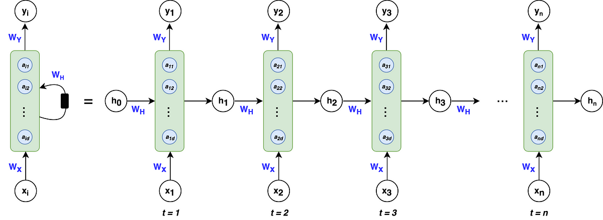

# Recurrent Neural Networks (RNN)

## Overview
Recurrent Neural Networks (RNNs) are a powerful class of neural networks specifically designed to handle sequential data and time-series analysis. Unlike traditional neural networks, RNNs have a unique architecture that allows them to maintain an internal memory of previous inputs, making them ideal for tasks involving sequential information.

## Key Characteristics

### Fundamental Architecture
- **Sequential Processing**: Designed to process sequences of data
- **Memory Mechanism**: Maintains an internal state (hidden state) 
- **Temporal Dependency**: Can capture relationships between sequential elements

### Core Components
1. **Input Layer**: Receives sequential input
2. **Hidden Layer**: Processes current input and previous hidden state
3. **Output Layer**: Generates predictions or classifications
4. **Recurrent Connection**: Allows information to persist across time steps

## Mathematical Representation

### Basic RNN Equations
At each time step t:

- Hidden State: 
$$h_t = \tanh(W_{hx} x_t + W_{hh} h_{t-1} + b_h)$$

- Output:
$$y_t = \text{softmax}(W_{yh} h_t + b_y)$$

Where:
- 𝑥ₜ : Input at time step 𝑡
- hₜ : Hidden state at time step 𝑡
- 𝑊ₕₓ : Weight matrix for input-to-hidden connection
- 𝑊ₕₕ : Weight matrix for hidden-to-hidden connection
- 𝑏ₕ : Hidden layer bias
- 𝑊ᵧₕ : Weight matrix for hidden-to-output connection
- 𝑏ᵧ : Output layer bias

## Types of RNNs

### 1. Simple RNN
- Basic recurrent architecture
- Limited in capturing long-term dependencies
- Suffers from vanishing/exploding gradient problem

### 2. Long Short-Term Memory (LSTM)
- Advanced RNN variant
- Uses gate mechanisms to control information flow
- Effectively captures long-term dependencies
- Includes:
  - Input Gate
  - Forget Gate
  - Output Gate
  - Cell State

### 3. Gated Recurrent Unit (GRU)
- Simplified version of LSTM
- Fewer parameters
- Similar performance to LSTM
- Uses two gates:
  - Reset Gate
  - Update Gate

## Applications

### Primary Use Cases
1. **Natural Language Processing**
   - Machine Translation
   - Sentiment Analysis
   - Text Generation

2. **Time Series Prediction**
   - Stock Market Forecasting
   - Weather Prediction
   - Demand Forecasting

3. **Speech Recognition**
   - Converting audio to text
   - Voice assistants

4. **Music Generation**
   - Composing sequences of musical notes

## Challenges and Limitations

### Computational Challenges
- **Vanishing Gradient Problem**: Difficulty in learning long-term dependencies
- **Computational Complexity**: Slower training compared to feed-forward networks
- **Memory Constraints**: Limited memory capacity

### Modern Alternatives
- Transformer Networks
- Attention Mechanisms
- Bidirectional RNNs

## Training Techniques

### Backpropagation Through Time (BPTT)
- Extends backpropagation to sequential data
- Unrolls the network across time steps
- Calculates gradients for weight updates

### Regularization
- Dropout
- Gradient Clipping
- L1/L2 Regularization

## Future Directions
- Improved architectures
- More efficient training algorithms
- Better handling of very long sequences
 